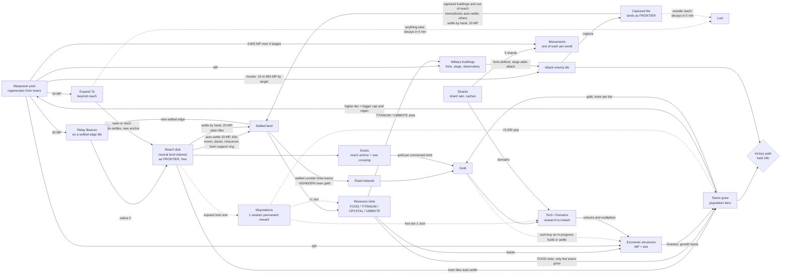
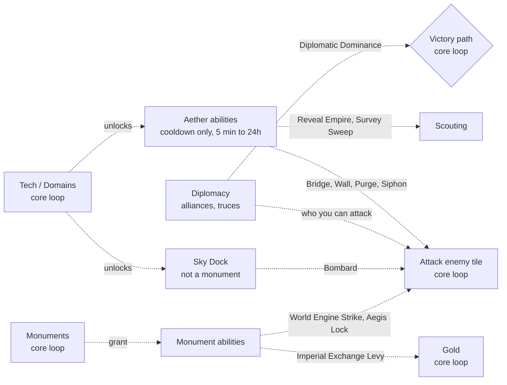

# Border Empires — Core Loop

What the player repeatedly does, why they do it, what it costs, and what
brings them back. This doc covers the **design shape** of the game.
`docs/game-mechanics.md` is the rules reference and
`docs/manpower-economy-rewrite-plan.md` has the economy derivations; this doc
links to them instead of repeating them.

Surveyed 2026-09-23 against the rewrite stack (`apps/simulation`,
`apps/realtime-gateway`, `packages/shared`, `packages/game-domain`,
`packages/client`). Every number here was read from code, not from older
docs. §12 lists the places where older docs have drifted from the code. When
a number changes, update the table in §9 in the same branch.

## How this doc is organised

A core loop doc normally covers these parts, and each one maps to a section:

| Part | Question it answers | Section |
|---|---|---|
| Core fantasy and pillars | What is the player *being*, and what must never be compromised? | §1 |
| Loop diagram | What is the cycle of action → reward → reinvestment? | §2 |
| Player verbs | What can the player actually do? | §3 |
| Nested loops (moment → session → day → season → meta) | What happens at each time scale, and how does each feed the next? | §4 |
| Economy: sources and sinks | Where does each resource come from, what consumes it, and what gates the pace? | §5 |
| Reinforcing and balancing loops | What makes you snowball, and what stops you? | §6 |
| Conflict loop and supporting loops | How does fighting plug into growing, and which systems are core and which are supporting? | §7, §7.1 |
| Onboarding loop | How does a new player learn the loop in their first session? | §8 |
| Pacing numbers | The timers and costs that set the rhythm | §9 |
| Return triggers | Why come back, and what happens while you're away? | §10 |
| Failure and recovery | What does losing look like, and how do you get back in? | §11 |
| Tensions and open questions | Where the loop is known to sag | §12 |

---

## 1. Core fantasy and design pillars

**One sentence:** *Push your reach outward from one small settlement by
placing Relay Beacons and taking towns, turn the ground they cover into
manpower, and spend that manpower to push your borders into rivals until you
hold one of five victory conditions for a full day.*

Pillars, inferred from code comments and design docs (each one is enforced
somewhere in code):

1. **Territory is the unit.** There are no unit pieces. Every action is a
   change of who owns a tile (`docs/game-mechanics.md` §4). Where your border
   sits, and what shape it has, *is* your army.
2. **Manpower is the real currency.** Expanding, settling, building and
   attacking all cost manpower. Gold was deliberately cut down to a support
   currency (`GOLD_RESCALE_DIVISOR = 288`, `server-game-constants.ts`) that
   pays for research, rush-buys and a few abilities. The in-game guide says
   it plainly: *"watch your manpower bar before your gold."*
3. **Check in a couple of times a day, not all day.** Each town tier's own
   cap/regen pair is tuned so that town alone would fill its share in about
   12h (`TOWN_MANPOWER_BY_TIER`, regen = cap / 720 min). The empire's pool is
   *not* a fixed 12h fill, though (see §5): Garrison Halls and rail-depot
   networks raise the cap without matching regen, the starting capital takes
   about 30h, and towns beyond the fifth give reduced regen. Offline yield
   stops accruing at 12h, and so does passive gold for an inactive human. The design explicitly avoids decay mechanics
   that punish time offline (`docs/expansion-motivation-exploration-brief.md` §3).
4. **Tall is viable against wide.** Resource *slots*, synthesizers with a hard
   cap and gold upkeep, and diminishing manpower regen per extra settlement
   (`manpowerRegenWeightForSettlementIndex`) keep a small, deeply developed
   empire competitive with one that just has more tiles (README).
5. **Several ways to win.** Five concurrent victory paths let an empire win
   through towns, gold, resources, sea control or diplomacy, not only by
   conquering.

## 2. The loop at a glance

Supporting loops (§7.1) are drawn separately so the core diagram stays
readable. They plug into the core loop at the boxes shown, but the core loop
runs without them:

Read the diagram as: **manpower → reach → settled land → towns and slots →
structures → more manpower**. Gold and tech are a side engine that multiplies
what the main engine does. Gold comes mainly from **towns**, which earn more as
they grow a tier, and from **docks**. War is the second way to get land (and towns) once neutral ground runs out.
Military buildings shape what war costs.

**Why settle plain tiles by hand?** Auto-settle skips most of a beacon's disk
(see the reach notes above), and settling one of those plain tiles costs 20 MP and
a development slot. It buys three things:

- **Defense.** FRONTIER has zero defense: an enemy captures it with a 15 MP
  attack and no roll. A SETTLED tile makes the attacker muster 40–60 MP and
  win a roll, gets exposure-based defense from friendly neighbours, and can
  hold a fort (§7).
- **Roads, which mean gold.** A town joined to other Town-tier-or-higher
  towns by an unbroken run of *settled* tiles gets +50% gold for the first
  connection, +40% for the second and +30% for the third, up to +120%
  (`connectedTownBonusForPlayer` in `economy-network.ts`; domains add more per
  step). FRONTIER tiles don't count as road, so a gap of unsettled ground
  breaks the connection.
- **Beacon sites.** A Relay Beacon needs a SETTLED tile, so settling a tile
  at the reach edge is how you set up the next push.

**Reach, not Expand To, is how territory grows** (`packages/shared/src/reach/reach.ts`):

- Towns (radius 3), docks (radius 1) and Relay Beacons (radius 5) are *reach
  anchors*. When one activates, every neutral land tile in its radius becomes
  your FRONTIER **instantly and free** (`autoClaimFrontier` in
  `runtime-reach-border-apply.ts`). The ground inside your reach is therefore
  already yours as FRONTIER. There is nothing left there to Expand To.
- Only some of that FRONTIER settles on its own: town and dock tiles, resource
  tiles you've revealed, and plain tiles inside a town's support ring (radius
  1, or 2 at Great City and up) (`isAutoSettlementEligibleTarget` in
  `territory-automation.ts`). The rest stays FRONTIER, with zero defense,
  unless you settle it by hand (20 MP, only while in reach).
- **You can't keep ground outside reach.** FRONTIER claimed or captured
  outside reach decays after 5 minutes (`OUT_OF_REACH_DECAY_MS`). A SETTLED
  tile whose reach is taken away is downgraded back to FRONTIER, and then it
  decays too.
- A Relay Beacon has to go on a SETTLED tile you own. So the growth step is:
  get a settled tile near the edge of your reach (usually a resource or
  town-ring tile that auto-settled) → build a beacon there (30 MP, 60s) → its
  radius-5 disk auto-claims the next ring of land → repeat.
- **Expand To is the way across gaps, not a way to settle.** Its lasting use
  is reaching a town or dock outside your reach. Towns and docks auto-settle
  even when out of reach, and then act as a new anchor. Any other tile claimed
  beyond reach is gone after 5 minutes.

The key idea is that **towns are never built, only acquired**. World gen
places `max(70, 180 × worldScale)` neutral towns, and the only ways to own
one are to settle onto it or capture it (`docs/game-mechanics.md` §2, §4).
Towns are what raise the manpower cap. So the whole loop points outward:
growing your economy *means* taking the land around you.

## 3. Player verbs

| Verb | What it does | Primary cost | Where |
|---|---|---|---|
| **Relay Beacon** | The main growth verb. An outpost on a SETTLED tile that anchors reach radius 5. Every neutral tile in that radius becomes your FRONTIER for free | 30 MP, 60s, uses a development slot | `RELAY_BEACON_SPEC`, `OUTPOST_REACH_RADIUS` |
| **Expand To** | Claim an adjacent neutral tile. Mostly used *beyond* reach to reach a town or dock, which then auto-settles and becomes an anchor. Other out-of-reach claims decay in 5 min | 10 MP, 7.5s (×1.5 forest/hills) | `EXPAND_MANPOWER_COST`, `FRONTIER_CLAIM_MS` |
| **Settle** | FRONTIER → SETTLED: produces yield, gains defense, can hold a structure. Only legal in reach (towns and docks excepted). Auto-settle does this for towns, docks, revealed resources and town-ring tiles | 20 MP, 60s, uses a development slot | `SETTLE_MANPOWER_COST`, `SETTLE_MS` |
| **Build** | Place one structure on a settled tile | MP (e.g. Farmstead 80, Fort/Bank 300) plus a resource slot, 1–10 min | `structure-registry*.ts`, `structure-slots.ts` |
| **Upgrade town** | Raise a town's tier once its population passes the threshold | 20/40/80/160 gold plus 1 FOOD slot | `TOWN_TIER_UPGRADE_GOLD_COST` |
| **Research** | Buy a tech (instant). Cost rises with the number already owned | 10 gold, then +30/+40/+50 per tech | `techGoldCostForResearchedCount` |
| **Choose domain** | Pick one doctrine per tier (5 tiers) | 40 → 1,800 gold, plus shards from tier 2 | `domain-tree.json` |
| **Muster / Attack** | Stage manpower on up to 2 flags (+ domain bonuses), then capture adjacent enemy tiles | Depends on the target: 10 MP (barbarian) to 960 MP (Thunder Bastion). See §7. 30s combat lock | `requiredMusterForTarget`, `ATTACK_MANPOWER_LOSS_RANGE`, `COMBAT_LOCK_MS` |
| **Build military** | Forts (defense), Siege Battery/Tower/Dread Tower (attack), Observatory (vision, protection from abilities) | Fort ladder 150–960 MP plus TITANIUM slots. Siege ladder 60 MP plus UMBRITE/TITANIUM slots | `FORT_TIER_LADDER`, `SIEGE_TIER_LADDER` |
| **Build monument** | One of six globally unique monuments (Imperial Exchange, World Engine, Aegis Dome, Astral Dock, Population Bureau, Titanium Levy). Built in 4 stages. Each is locked by a tech, and the first empire to build one locks everyone else out | 3 × (1,000 MP + 1 shard), then 1,600 MP + 2 shards: 4,600 MP and 5 shards in total | `MONUMENTAL_STRUCTURE_TYPES`, `structure-costs.ts` |
| **Build Sky Dock** | Ability structure, not a monument. Needs a powered Aether Tower and grants Bombard (range 30, 20 min cooldown, 15% base miss chance, +25% against forts) | 150 MP, doubling per Sky Dock owned | `AIRPORT` in `structure-costs.ts`, `AIRPORT_BOMBARD_*` |
| **Collect** | Bank accrued tile yield (20s cooldown) | — | `COLLECT_VISIBLE` in `runtime.ts` |
| **Rush-buy** | Finish an in-progress settle or build with gold | 0.5 gold × MP × fraction of time left | `rush-buy.ts` |
| **Queue / Waypoint** | Plan settles, builds and routes that run while you're away | — | `dev-queue.ts`, `waypoint-planner.ts` |
| **Diplomacy** | Alliances, and truces of 12h or 24h | Breaking a truce locks you out of truces for 24h | `social-state.ts` |
| **Abilities** | Reveal Empire, Survey Sweep, Aether Purge/Bridge/Wall, Siphon, terrain shaping, monument strikes. Each is unlocked by a tech. See §7.1 | Cooldown only, 5 min to 24h (a few also cost gold) | `ABILITY_DEFS` in `server-game-constants.ts` |

## 4. Nested loops

Each loop feeds the next one up. The moment loop earns manpower's worth of
land, the session loop turns that land into development, the daily loop
turns development into town tiers, and the season loop turns town tiers into
a victory hold.

### 4.1 Moment-to-moment (a minute or two): "push the reach edge"

1. Look at the reach overlay. Where is the edge of my reach, and what is just
   past it: a town, a dock, food, resources?
2. Pick a SETTLED tile near that edge and build a **Relay Beacon** (30 MP,
   60s).
3. When it activates, every neutral land tile within radius 5 becomes your
   FRONTIER at once. **FRONTIER has zero defense**, so any adjacent enemy takes
   it without a roll (`frontier-combat.ts`).
4. Auto-settle (20 MP, 60s each, one per free development slot) works through
   the tiles that qualify: towns, docks, revealed resources, and the town
   support ring. Settle other tiles by hand if you want them defended or need
   one as the next beacon site.
5. Settled tiles yield, can hold a structure, add to your exposure-based
   defense, and one of them becomes the next beacon site.

For a town or dock outside reach, **Expand To** a path of tiles out to it
(10 MP each, 7.5s, or 11.25s on forest or hills). The town or dock
auto-settles and anchors its own reach. The path tiles behind it decay after
5 minutes unless reach covers them by then.

The feedback at this scale is the beacon's disk filling in all at once, the
border jumping outward, a waystation or watchtower popping when you land on
one, and resource tiles lighting up.

**What limits it:** your manpower pool, your 3 development slots
(`DEVELOPMENT_PROCESS_LIMIT`, up to +4 from domains). Beacons, settles and
builds all share those slots. And reach itself (§6.2).

### 4.2 Session loop (a 5–20 minute check-in): "spend the pool, set up the next half-day"

1. **Arrive.** The Activity dashboard opens with "since you were away":
   combat, captures, waystation activations (`docs/activity-dashboard-plan.md`).
2. **Collect** accrued yield (capped at 12h of accrual).
3. **Triage threats.** Retake lost frontier, and fort up any exposed settled
   tiles.
4. **Spend manpower** on beacons toward the next town or food tile, Expand To
   paths to out-of-reach towns and docks, settling, and building.
5. **Spend gold** on the next tech, a domain, or a town tier upgrade. Rush-buy
   anything close to finishing.
6. **Queue the future.** Up to 20 server-side dev-queue entries (plus 40
   client-planned ones) and waypoint routes that the server replays after
   15s offline (`WAYPOINT_OFFLINE_GRACE_MS`).
7. **Leave.** Manpower refills while you're away.

The session is sized to spend the manpower that built up since your last
visit. How long a full refill takes depends on how you've built your empire
(§5), not on a fixed timer.
Queues and waypoints exist so that leaving doesn't waste the time you're
away.

### 4.3 Daily loop (about 12h cadence): "grow a tier"

- Manpower refills. Fill time varies by empire: each town adds cap and regen
  at a 12h ratio, but the starting capital (720 MP at 0.4/min, about 30h),
  cap-only bonuses (Garrison Hall +150, rail-depot networks) and reduced
  regen from towns past the fifth all stretch it.
- Town populations grow toward the next tier (10k → 100k → 1M → 5M). Settling
  plain land does *not* grow towns. Growth depends on the town itself
  (`runtime-population-growth.ts`): its tile must be settled, it must be
  **fed** (its FOOD-slot demand met), there must be no combat within 10
  tiles in the last hour, and it must not be in the 10-minute capture shock.
  Growth follows a logistic curve toward the town's max population and is
  multiplied by Granary, a 24h-peace bonus (×1.2), domains and empire
  integrity. You upgrade with gold and an extra FOOD slot. A higher tier raises the manpower
  cap and regen (150 → 300 → 450 → 750 → 1,350 cap).
- **Shard rain** at 08:00 and 21:00 UTC scatters 3–6 shard sites with a 30-min
  TTL (`runtime-shard-rain-rules.ts`). This is a scheduled, contested reason to
  be online, and shards pay for domains and monuments.
- Truces (12h or 24h) and victory holds (24h) are sized in days too.

### 4.4 Season loop (30 days, `SEASON_LENGTH_DAYS`): "pick a path and hold it"

The phases the AI planner models (`docs/game-mechanics.md` §7), which match
the player arc:

| Phase | Player focus | Typical actions |
|---|---|---|
| **Opening** (day 0–2) | Grab a town and 4 food slots, and push reach outward | Relay Beacons, Expand To a nearby town, first techs (Agrarian Works) |
| **Build-up** | Grow town tiers, fill slots, pick domains | Structures, town upgrades, docks, clearing barbarians |
| **Contact / war** | Borders meet. Take towns, docks and resource tiles from rivals | Muster, siege outposts, forts, truces and alliances |
| **Victory race** | Reach a threshold and hold it for 24h while everyone else turns on the leader | Defend the path you're on, or pivot to another |

Victory thresholds (`SEASON_VICTORY_*`): towns ≥50%; income ≥1.33× the next
player's and ≥1,000 gold/day; ≥80% of one resource type; ≥55% of docks (min
3); alliance bloc ≥66% of land with you as its largest member. All are held
for 24h, and the client streams leader and hold-time live, so there are no
hidden standings.

### 4.5 Meta loop (across seasons)

Territory and progression reset each season. These carry over: account,
cosmetics, history, and the **galactic layer** (`docs/galactic-campaign-design.md`).
A season winner gets a durable, nameable Planet and a "Duke" title, plus
one-time starting bonuses in the next season (`GALACTIC_WONDER_*`). Planet
holders get the Space View economy (Influence/Production, Senate, Fleets).
New seasons need a player vote to start.

**Known gap:** that doc's §20 says the meta layer gives nothing to do to an
empire that *isn't* winning seasons. In practice, the meta loop today rewards
winners only.

## 5. Economy: sources, sinks, and the gate

| Resource | Sources | Sinks | Role |
|---|---|---|---|
| **Manpower (MP)** | Cap and regen come from the starting capital (720 cap, 0.4/min) plus each owned town by tier. Cap and regen scale separately, so there's no fixed time to fill the pool. Regen weight per settlement drops (×1 for the first 5, ×0.5 up to 15, ×0.2 after). Garrison Hall and rail-depot bonuses | Expand 10, Settle 20, Relay Beacon 30, structures 80–960, attacks 10–960 depending on target (via muster) | **The pacing gate.** Everything physical costs MP |
| **Gold** | **Towns**: about 10/day base per fed town, ×1 / 1.25 / 1.75 / 2.1 at Town / City / Great City / Metropolis (`townPopulationMultiplier`), times the road-network bonus and Mintworks. Paused while a town is unfed. **Docks**: a base amount per dock plus a bonus per connected dock (`DOCK_INCOME_PER_MIN`, Customs House adds more). Also Banks and barbarian clears (+5). Stops after 12h inactive | Tech (rising cost), domains, town upgrades, rush-buy, synthesizer upkeep, a few abilities | Support currency: progression and acceleration |
| **FOOD / TITANIUM / CRYSTAL / UMBRITE** | *Slots* from owned resource tiles (FARM 1, FISH 2, …), boosted by structures, waystations and domains | Each structure or town tier permanently *occupies* a slot. If a slot is lost, the structure goes **dormant** instead of being destroyed | Slots, not stockpiles. Land quality limits development |
| **Shard** | Initial scatter, shard rain, waystation/doctrine progress | Domains (tier 2+), monuments | Scarce and contested. Feeds late-game power |

**Why manpower is the gate:** gold was rescaled so it could no longer outrun
every sink (`docs/manpower-economy-rewrite-plan.md` §6). Manpower is capped by
town tiers, and towns come only from land. So the only way to act more often
is to **own more and better towns**. That is what connects the economy back
to expansion and war.

## 6. Reinforcing and balancing loops

### 6.1 Reinforcing (the snowball)

- **Town engine:** more land → more towns → higher tiers → bigger MP cap and
  regen **and** more gold per town → more land and faster tech.
- **Slot engine:** more resource tiles → more slots → more active structures →
  more growth, income and defense.
- **Road network:** a town linked to up to 3 other Town-tier-or-higher towns
  by unbroken settled land gets +50% / +40% / +30% gold per link
  (`connectedTownBonusForPlayer`). This rewards settling the corridors
  between towns, not just the towns themselves.
- **Tech and domains:** multipliers on everything above, including +1
  development slot doctrines that speed up the moment loop itself.

### 6.2 Balancing (what stops runaway growth)

- **Reach.** Ground only stays yours inside your reach border. Towns grant
  radius 3, Relay Beacons and outposts radius 5, docks radius 1 (`reach.ts`).
  FRONTIER outside reach **decays after 5 min** (`OUT_OF_REACH_DECAY_MS`), and
  a SETTLED tile that loses reach is downgraded to FRONTIER. Settling (manual
  or auto) is only legal in reach, except for towns and docks. Losing a beacon
  or town pulls reach back over its whole disk, so anchors are what really
  hold territory. Reach turns "expand anywhere" into a sequence: take an
  anchor → its disk auto-claims → settle an edge tile → beacon → repeat.
- **Development slots.** 3 concurrent settle/build processes (up to 7 with
  domains), shared between settling and building. This is intentional
  friction between expanding and optimising.
- **Diminishing MP regen per settlement** and the empire-wide storage cap
  (income × 12h).
- **Slot dormancy.** Building past your land's slot supply does nothing.
- **Exposure-based defense.** Wide, stringy borders are weak, and FRONTIER
  tiles have zero defense.
- **Encirclement.** Losing a key tile can cut off nearby frontier.
- **Leader pile-on.** The 24h hold and live standings let everyone see and
  target the leader.
- **Barbarians.** 80 seeded camps wake up when you border them and can
  multiply onto valuable tiles.

## 7. Conflict loop

1. **Scout:** vision is small by default (radius 1, +1 on hills). Watchtowers,
   waystations, beacons and observatories extend it.
2. **Build military:** forts on exposed settled tiles, siege buildings behind
   your front line (they can go on unsettled frontier too), and observatories
   for vision and protection from enemy abilities. These are the *defense* and
   *attack* halves of the conflict loop, paid for with manpower and resource
   slots, so they compete with economic structures for the same budget.
3. **Stage:** plant muster flags (cap = 10% of MP cap). Manpower gathers at
   180/min base.
4. **Strike:** the manpower an attack needs depends on the target
   (`requiredMusterForTarget`, `ATTACK_MANPOWER_LOSS_RANGE`). The flag must
   hold the maximum. The amount actually lost is random within the range,
   whether you win or lose:

   | Target | Manpower lost |
   |---|---|
   | Barbarian tile | 10 (from the pool, no muster needed) |
   | Enemy FRONTIER | 15. Captured instantly, no roll |
   | Settled, no fort | 40–60 |
   | Palisade | 100–150 |
   | Fort | 200–300 |
   | Titanium Bastion | 350–480 |
   | Thunder Bastion | 800–960 |

   Each fort tier's maximum equals that fort's build cost: *attacking it costs
   as much as building it*. There is a 30s combat lock (2s/tile march for
   muster auto-attacks). Win chance = atk² / (atk² + def²)
   (`frontier-combat.ts`). Siege buildings multiply attack (×1.6 / 1.8 / 2.0)
   and forts multiply defense (×1.35 / 2.5 / 4 / 8).
5. **Resolve:** the winner takes the tile, including any town, dock or
   resource record on it. **A captured tile lands as FRONTIER, not SETTLED**
   (`runtime-lock-resolution.ts`). Captured buildings (forts, observatories,
   economic structures) auto-settle straight away. Captured towns and docks
   auto-settle only if they'd otherwise decay for being outside your reach
   (`capturedTileWillAutoSettle`). Everything else has to be settled by hand
   (20 MP, in reach) or it stays zero-defense FRONTIER, and outside reach it
   decays in 5 minutes. A failed assault can lose the **origin** tile.
   Eliminated players respawn.
6. **Consolidate:** settle captured ground, re-anchor reach, fort the new
   border, or offer a truce.

Barbarians are the tutorial for this loop: combat without PvP risk that pays
gold. Stage Muster unlocks when you first touch a barbarian.

### 7.1 Supporting loops: what is core and what isn't

A rule of thumb for what counts as core: a system belongs in the core loop if
the main cycle (manpower → reach → land → towns → manpower) stops or changes
shape without it. Otherwise it's a supporting loop that plugs into the core
loop at a named point.

| System | Verdict | Why | Where it plugs in |
|---|---|---|---|
| **Town gold** | **Core** | Towns are what the core loop builds toward, and they are the main gold source. Growing a tier raises MP *and* gold | Towns → Gold |
| **Dock gold** | **Core (part of the economy)** | Docks are reach anchors, gold sources, and a victory path (Maritime Supremacy) at once. Island-heavy maps make them important | Reach → Docks → Gold, sea crossings |
| **Military buildings** | **Core, in the conflict loop** | War is the second source of land. Forts and siege set how much taking land costs, and they compete with economic buildings for MP and slots | Structures → Attack/defense |
| **Aether abilities** | **Supporting (tactical layer)** | Each is unlocked by a tech and limited only by its cooldown (5 min to 24h). They change *how* you fight or scout (Aether Bridge crosses water, Aether Wall blocks, Reveal Empire, terrain shaping; Siphon, which needs an Observatory within 30 tiles, zeroes the output of enemy town and resource tiles in a 3×3 area for 60 min) but spend nothing from the core economy. Nothing in the core loop stops without them | Tech → abilities → Attack/scouting |
| **Shards** | **Core (late-game currency)** | The gate on domains from tier 2 and on monuments. They only come from shard rain (08:00 and 21:00 UTC, 30-min TTL), the initial scatter and caches, so they give players a scheduled, contested reason to be online | Shards → Domains, Monuments |
| **Waystations** | **Core (reward for expanding)** | About one per 400 tiles, world-generated. Expanding onto one activates it once, granting one random permanent reward: permanent vision around the nearest town, a +5,000 population burst, a free tier-1 tech, or +1 resource slot (`runtime-waystation-activation.ts`). They are a direct reason to push reach toward a particular spot | Reach → Waystations → Slots / Towns / Tech |
| **Monuments** | **Core as a late-game sink, supporting through their abilities** | Six globally unique buildings that cost 4,600 MP and 5 shards, which makes them the biggest manpower and shard sink in the game. Unlike economic or military buildings, they give *abilities*: Imperial Exchange Levy (takes 100% of a target's gold, 24h cooldown), World Engine Strike (1,000 gold, 30% population loss, 10 min), Aegis Dome's Aegis Lock (blocks attacks for 15 min, 60 min cooldown), Astral Dock Launch (1,000 gold, 24h satellite). Population Bureau and Titanium Levy feed manpower instead | Manpower + Shards → Monuments → abilities |
| **Sky Dock** | **Supporting (ability structure, not a monument)** | Works like a monument ability but isn't unique and has no stages: 150 MP (doubling per copy), and it needs a powered Aether Tower. Its Bombard hits tiles up to 30 away | Tech → Sky Dock → Attack |
| **Diplomacy** | **Supporting (social layer)**, with one exception | Alliances and truces decide *who* you fight and when, not how you grow. Allies can't attack each other, and breaking a truce locks you out of truces for 24h. The exception: **Diplomatic Dominance** is a victory path, so for a player going for it, diplomacy moves into the season loop | Choice of attack target; the Victory path |

Keep supporting loops out of the core loop diagram. Mention them where they
plug in, so the diagram stays readable and the core cycle stays visible.

## 8. Onboarding loop (first session)

As implemented in `client-onboarding-checklist.ts` and `guideSteps`
(`client-constants.ts`):

1. An 8-step guide modal covers the fantasy, expanding, manpower, slots,
   building and fighting, research, towns, and winning.
2. A checklist with 4 goals, all driven by Expand To: **find a town → expand
   to it → find food → expand to 4 food slots**. The map highlights the next
   tile in reach. If nothing is in reach, it points you at building a Relay
   Beacon. (See §12: this teaches Expand To as the main verb, but in practice
   beacons are what move reach, and Expand To mostly matters beyond reach.)
3. The starting capital is sized for about 40 expands and 8 settles before
   you wait on regen (`STARTING_CAPITAL_MANPOWER_CAP` comment). The first
   session is long enough to finish the checklist without stalling.
4. New players spawn a safe distance from the nearest town. The first town is
   a short trip that teaches reach.

At the end, the player is food-secure with a second town, which is the full
town-engine loop at small scale.

## 9. Pacing numbers

| Knob | Value | Source |
|---|---|---|
| World | 640×320, toroidal | `config.ts` |
| Expand | 10 MP, 7.5s (11.25s forest/hills) | `EXPAND_MANPOWER_COST`, `FRONTIER_CLAIM_MS` |
| Settle | 20 MP, 60s (90s forest/hills) | `SETTLE_MANPOWER_COST`, `SETTLE_MS` |
| Relay Beacon | 30 MP, 60s. Radius 5; claims every neutral tile in it as FRONTIER, free | `RELAY_BEACON_SPEC`, `OUTPOST_REACH_RADIUS` |
| Development slots | 3 (+1 each from 4 domains) | `DEVELOPMENT_PROCESS_LIMIT` |
| Attack | 10–960 MP depending on target (§7), 30s lock | `ATTACK_MANPOWER_LOSS_RANGE`, `COMBAT_LOCK_MS` |
| Structure build | Economic 5 min, Fort/Observatory 10 min, Beacon/Siege 1 min | `*_BUILD_MS` |
| MP cap by town tier | 150 / 300 / 450 / 750 / 1,350, each tier's regen = cap / 720 min | `TOWN_MANPOWER_BY_TIER` |
| MP regen weight per town | ×1 for the first 5, ×0.5 up to 15, ×0.2 after | `manpowerRegenWeightForSettlementIndex` |
| Cap-only MP bonuses | Garrison Hall +150, rail-depot network +300 per Garrison Hall | `GARRISON_HALL_*`, `RAIL_DEPOT_NETWORK_*` |
| Starting capital | 720 MP cap, 0.4/min | `STARTING_CAPITAL_*` |
| Town tier population | 10k / 100k / 1M / 5M | `town-growth.ts` |
| Town upgrade gold | 20 / 40 / 80 / 160 | `TOWN_TIER_UPGRADE_GOLD_COST` |
| Tech cost | 10 gold, then +30 (techs 1–4), +40 (5–9), +50 (10+) | `tech-economy.ts` |
| Domain cost | 40 / 200+1 shard / 400+2 / 800+3 / 1,800+5 | `domain-tree.json` |
| Reach radius | Town 3, Outpost/Beacon 5, Dock 1 | `*_REACH_RADIUS` |
| Out-of-reach decay | 5 min | `OUT_OF_REACH_DECAY_MS` |
| Offline yield / gold inactivity cap | 12h | `OFFLINE_YIELD_ACCUM_MAX_MS`, `simulation-service.ts` |
| Shard rain | 08:00 and 21:00 UTC, 3–6 sites, 30-min TTL | `runtime-shard-rain-rules.ts` |
| Victory hold | 24h | `SEASON_VICTORY_HOLD_MS` |
| Season | 30 days | `SEASON_LENGTH_DAYS` |

## 10. Return triggers and what happens while you're away

**What pulls you back:**

- A full manpower bar.
- The 12h yield and gold caps.
- Town tier thresholds reached.
- Shard rain times.
- Victory hold countdowns.
- Email notifications (per-category opt-in in settings).
- Waystation activations while you're away.
- The Activity dashboard's "since you were away" briefing.

**What keeps working while you're away:**

- The dev queue drains.
- Waypoint routes replay on the server.
- Enclosed regions auto-fill on settle (`runtime-auto-fill.ts`).
- Captured anchors auto-settle.
- Manpower regenerates.

**What you risk by being away:** unsettled frontier is free to take, and
rivals and barbarians keep acting. The design accepts this, and there is
deliberately no decay for simply being offline.

## 11. Failure and recovery states

| State | Cause | Consequence | Recovery |
|---|---|---|---|
| Out of manpower | Overspent | Can't act | Wait for regen or rush-buy with gold |
| Dormant structure | Lost its slot-backing tile | Stops giving its bonus but stays standing | Retake the resource or free a slot |
| Unfed town | Not enough food support | Gold income pauses | Add FOOD slots or build a Granary |
| Out-of-reach frontier | Lost the anchor | Decays in 5 min | Re-anchor with a beacon or recapture |
| Eliminated | Last tile lost | Respawn (`respawnIfEliminated`) | Start again mid-season |
| Lost the season | Someone held a path for 24h | Season ends, score graph | Next season; the galactic layer if you won |

## 12. Known tensions and open questions

1. **Expansion goes flat in mid-game.** Beta feedback: "I stop expanding once
   my economy runs." Causes are grounded in
   `docs/expansion-motivation-exploration-brief.md`: identical claim clicks,
   shared dev slots, resource sufficiency, and flat cost relative to income.
   Moving expansion to manpower cost partly addresses the cost issue.
   Repetition and sufficiency are still open.
2. **The meta loop only rewards winners**
   (`docs/galactic-campaign-design.md` §20).
3. **Empire integrity** is live but inert in practice, because its input
   metric parks near 50% for almost everyone (expansion brief §7).
4. **Onboarding teaches the wrong growth verb.** The checklist and guide
   frame Expand To as how you grow ("Tap a neutral tile next to your border to
   claim it… Settle it"). In the live game, beacons and town/dock anchors move
   reach and auto-claim everything inside it, and Expand To mostly matters for
   crossing to an out-of-reach town or dock. Players who follow the guide will
   Expand To tiles beyond reach and watch them decay. The guide and checklist
   should say that reach comes from beacons and that ground beyond reach
   doesn't last.
5. **Most of a beacon disk stays FRONTIER.** Auto-settle only takes towns,
   docks, revealed resources and the town support ring. Everything else in a
   radius-5 disk is zero-defense FRONTIER that any neighbour takes without a
   roll, unless you spend 20 MP a tile settling it. That isn't necessarily
   bad: it makes *which* plain tiles to settle a real choice between defense,
   road corridors between towns, and beacon sites. But neither the UI nor the
   guide explains the trade-off.
6. **The runaway leader** is held back only by the 24h hold and social
   pile-on. There is no systemic catch-up mechanic besides respawn.
7. **Siphon: design intent and code may disagree.** Siphon has been
   described as giving the caster resource slots. In the code
   (`runtime-siphon-command-handlers.ts`, `tile-yield-view.ts`) it only sets
   the targets' output multiplier to 0 for 60 minutes. Nothing credits the
   caster and nothing touches slots. The client tooltip ("siphons … at 100%
   output") suggests a transfer was intended. Needs a decision: either the
   code is missing the transfer, or the description should change.
8. **Doc drift found while writing this.** The code is authoritative:
   - README says combat takes a "3-second lock". `COMBAT_LOCK_MS` is 30s, and
     attacks on FRONTIER are instant.
   - README says research costs "gold + strategic resources + time". It is
     instant and gold-only (`chooseTechForPlayer`). `researchTimeSeconds` in
     `tech-tree.json` is not enforced by the simulation.
   - `docs/game-mechanics.md` says Settle costs gold and gives METROPOLIS
     "120/min cap 2400". Actually `SETTLE_COST = 0` and METROPOLIS is a 1,350
     cap. It also lists shard rain at hours [12, 20], but the live schedule is
     [8, 21] UTC (`runtime-shard-rain-rules.ts`). The `SHARD_RAIN_SCHEDULE_HOURS`
     in `server-game-constants.ts` is stale.
   - The expansion brief quotes `FRONTIER_CLAIM_COST = 1` and a 1.25s claim.
     The claim cost is now 0 gold and 10 MP, and the claim takes 7.5s.
   - The in-game guide says "plant up to 5 muster flags". `MUSTER_MAX_TILES`
     is 2, plus 1–2 from each of four domains.
