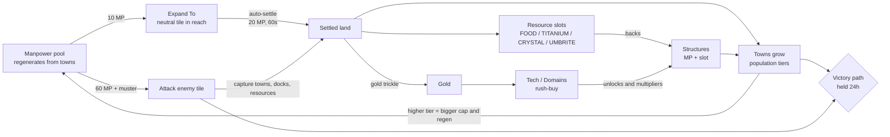

# Border Empires — Core Loop

What the player repeatedly does, why they do it, what it costs, and what
brings them back. This doc covers the **design shape** of the game.
`docs/game-mechanics.md` is the rules reference and
`docs/manpower-economy-rewrite-plan.md` has the economy derivations; this doc
links to them instead of repeating them.

Surveyed 2026-09-23 against the rewrite stack (`apps/simulation`,
`apps/realtime-gateway`, `packages/shared`, `packages/game-domain`,
`packages/client`). Every number here was read from code, not from older
docs. §12 lists the places where older docs have drifted from the code. When
a number changes, update the table in §9 in the same branch.

## How this doc is organised

A core loop doc normally covers these parts, and each one maps to a section:

| Part | Question it answers | Section |
|---|---|---|
| Core fantasy and pillars | What is the player *being*, and what must never be compromised? | §1 |
| Loop diagram | What is the cycle of action → reward → reinvestment? | §2 |
| Player verbs | What can the player actually do? | §3 |
| Nested loops (moment → session → day → season → meta) | What happens at each time scale, and how does each feed the next? | §4 |
| Economy: sources and sinks | Where does each resource come from, what consumes it, and what gates the pace? | §5 |
| Reinforcing and balancing loops | What makes you snowball, and what stops you? | §6 |
| Conflict loop | How does fighting plug into growing? | §7 |
| Onboarding loop | How does a new player learn the loop in their first session? | §8 |
| Pacing numbers | The timers and costs that set the rhythm | §9 |
| Return triggers | Why come back, and what happens while you're away? | §10 |
| Failure and recovery | What does losing look like, and how do you get back in? | §11 |
| Tensions and open questions | Where the loop is known to sag | §12 |

---

## 1. Core fantasy and design pillars

**One sentence:** *Grow an empire outward tile by tile from one small
settlement, turn the land you take into manpower, and spend that manpower to
push your borders into rivals until you hold one of five victory conditions
for a full day.*

Pillars, inferred from code comments and design docs (each one is enforced
somewhere in code):

1. **Territory is the unit.** There are no unit pieces. Every action is a
   change of who owns a tile (`docs/game-mechanics.md` §4). Where your border
   sits, and what shape it has, *is* your army.
2. **Manpower is the real currency.** Expanding, settling, building and
   attacking all cost manpower. Gold was deliberately cut down to a support
   currency (`GOLD_RESCALE_DIVISOR = 288`, `server-game-constants.ts`) that
   pays for research, rush-buys and a few abilities. The in-game guide says
   it plainly: *"watch your manpower bar before your gold."*
3. **Check in twice a day, not all day.** Manpower is tuned so a settlement
   fills its cap in about 12h (`config.ts`, `MANPOWER_BASE_REGEN_PER_MINUTE`
   comment). Offline yield also stops accruing at 12h, and so does passive
   gold for an inactive human. The design explicitly avoids decay mechanics
   that punish time offline (`docs/expansion-motivation-exploration-brief.md` §3).
4. **Tall is viable against wide.** Resource *slots*, synthesizers with a hard
   cap and gold upkeep, and diminishing manpower regen per extra settlement
   (`manpowerRegenWeightForSettlementIndex`) keep a small, deeply developed
   empire competitive with one that just has more tiles (README).
5. **Several ways to win.** Five concurrent victory paths let an empire win
   through towns, gold, resources, sea control or diplomacy, not only by
   conquering.

## 2. The loop at a glance

Read the diagram as: **manpower → land → towns and slots → structures → more
manpower**, with gold and tech as a side engine that multiplies what the main
engine does, and war as a second way to get land (and towns) once neutral
ground runs out.

The key idea is that **towns are never built, only acquired**. World gen
places `max(70, 180 × worldScale)` neutral towns, and the only ways to own
one are to settle onto it or capture it (`docs/game-mechanics.md` §2, §4).
Towns are what raise the manpower cap. So the whole loop points outward:
growing your economy *means* taking the land around you.

## 3. Player verbs

| Verb | What it does | Primary cost | Where |
|---|---|---|---|
| **Expand To** | Claim an adjacent neutral tile inside your reach. The client auto-settles it once ownership lands | 10 MP, 7.5s (×1.5 forest/hills) | `EXPAND_MANPOWER_COST`, `FRONTIER_CLAIM_MS` |
| **Settle** | FRONTIER → SETTLED: produces yield, gains defense, can hold a structure | 20 MP, 60s, uses a development slot | `SETTLE_MANPOWER_COST`, `SETTLE_MS` |
| **Build** | Place one structure on a settled tile | MP (e.g. Farmstead 80, Fort/Bank 300) plus a resource slot, 1–10 min | `structure-registry*.ts`, `structure-slots.ts` |
| **Upgrade town** | Raise a town's tier once its population passes the threshold | 20/40/80/160 gold plus 1 FOOD slot | `TOWN_TIER_UPGRADE_GOLD_COST` |
| **Research** | Buy a tech (instant). Cost rises with the number already owned | 10 gold, then +30/+40/+50 per tech | `techGoldCostForResearchedCount` |
| **Choose domain** | Pick one doctrine per tier (5 tiers) | 40 → 1,800 gold, plus shards from tier 2 | `domain-tree.json` |
| **Muster / Attack** | Stage manpower on up to 2 flags (+ domain bonuses), then capture adjacent enemy tiles | 60 MP per attack, 30s combat lock | `MUSTER_*`, `ATTACK_MANPOWER_COST`, `COMBAT_LOCK_MS` |
| **Relay Beacon** | Outpost that extends reach by radius 5 into new land | 30 MP, 60s | `RELAY_BEACON_SPEC` |
| **Collect** | Bank accrued tile yield (20s cooldown) | — | `COLLECT_VISIBLE` in `runtime.ts` |
| **Rush-buy** | Finish an in-progress settle or build with gold | 0.5 gold × MP × fraction of time left | `rush-buy.ts` |
| **Queue / Waypoint** | Plan settles, builds and routes that run while you're away | — | `dev-queue.ts`, `waypoint-planner.ts` |
| **Diplomacy** | Alliances, and truces of 12h or 24h | Breaking a truce locks you out of truces for 24h | `social-state.ts` |
| **Abilities** | Reveal Empire, Aether Bridge/Wall, Siphon… | Cooldown only (a few also cost gold) | README "Economy" |

## 4. Nested loops

Each loop feeds the next one up. The moment loop earns manpower's worth of
land, the session loop turns that land into development, the daily loop
turns development into town tiers, and the season loop turns town tiers into
a victory hold.

### 4.1 Moment-to-moment (seconds to about a minute): "take the next tile"

1. Look at the reach overlay: which neutral tiles can I claim?
2. Tap a tile and choose **Expand To** (10 MP). Wait 7.5s, or 11.25s on forest
   or hills.
3. The tile becomes FRONTIER. **FRONTIER has zero defense**, so any adjacent
   enemy takes it without a roll (`frontier-combat.ts`). That pushes you to
   settle quickly.
4. Auto-settle starts (20 MP, 60s) if a development slot is free.
5. The tile becomes SETTLED. It yields, can hold a structure, and adds to your
   exposure-based defense.

The feedback at this scale is the claim sweep, the border moving, a waystation
or watchtower popping when you land on one, and resource tiles lighting up.

**What limits it:** your manpower pool, your 3 development slots
(`DEVELOPMENT_PROCESS_LIMIT`, up to +4 from domains), and your reach (§6.2).

### 4.2 Session loop (a 5–20 minute check-in): "spend the pool, set up the next half-day"

1. **Arrive.** The Activity dashboard opens with "since you were away":
   combat, captures, waystation activations (`docs/activity-dashboard-plan.md`).
2. **Collect** accrued yield (capped at 12h of accrual).
3. **Triage threats.** Retake lost frontier, and fort up any exposed settled
   tiles.
4. **Spend manpower** on expanding toward the next town or food tile, settling,
   and building.
5. **Spend gold** on the next tech, a domain, or a town tier upgrade. Rush-buy
   anything close to finishing.
6. **Queue the future.** Up to 20 server-side dev-queue entries (plus 40
   client-planned ones) and waypoint routes that the server replays after
   15s offline (`WAYPOINT_OFFLINE_GRACE_MS`).
7. **Leave.** Manpower refills over the next ~12h.

The session is sized to use up a manpower pool that took half a day to fill.
Queues and waypoints exist so that leaving doesn't waste the time you're
away.

### 4.3 Daily loop (about 12h cadence): "grow a tier"

- Manpower refills (about 12h per town tier's cap; the starting capital is
  720 MP over about 30h).
- Town populations grow toward the next tier (10k → 100k → 1M → 5M). You
  upgrade with gold and an extra FOOD slot. A higher tier raises the manpower
  cap and regen (150 → 300 → 450 → 750 → 1,350 cap).
- **Shard rain** at 08:00 and 21:00 UTC scatters 3–6 shard sites with a 30-min
  TTL (`runtime-shard-rain-rules.ts`). This is a scheduled, contested reason to
  be online, and shards pay for domains and monuments.
- Truces (12h or 24h) and victory holds (24h) are sized in days too.

### 4.4 Season loop (30 days, `SEASON_LENGTH_DAYS`): "pick a path and hold it"

The phases the AI planner models (`docs/game-mechanics.md` §7), which match
the player arc:

| Phase | Player focus | Typical actions |
|---|---|---|
| **Opening** (day 0–2) | Grab a town and 4 food slots, and find the reach edge | Expand To, Relay Beacon, first techs (Agrarian Works) |
| **Build-up** | Grow town tiers, fill slots, pick domains | Structures, town upgrades, docks, clearing barbarians |
| **Contact / war** | Borders meet. Take towns, docks and resource tiles from rivals | Muster, siege outposts, forts, truces and alliances |
| **Victory race** | Reach a threshold and hold it for 24h while everyone else turns on the leader | Defend the path you're on, or pivot to another |

Victory thresholds (`SEASON_VICTORY_*`): towns ≥50%; income ≥1.33× the next
player's and ≥1,000 gold/day; ≥80% of one resource type; ≥55% of docks (min
3); alliance bloc ≥66% of land with you as its largest member. All are held
for 24h, and the client streams leader and hold-time live, so there are no
hidden standings.

### 4.5 Meta loop (across seasons)

Territory and progression reset each season. These carry over: account,
cosmetics, history, and the **galactic layer** (`docs/galactic-campaign-design.md`).
A season winner gets a durable, nameable Planet and a "Duke" title, plus
one-time starting bonuses in the next season (`GALACTIC_WONDER_*`). Planet
holders get the Space View economy (Influence/Production, Senate, Fleets).
New seasons need a player vote to start.

**Known gap:** that doc's §20 says the meta layer gives nothing to do to an
empire that *isn't* winning seasons. In practice, the meta loop today rewards
winners only.

## 5. Economy: sources, sinks, and the gate

| Resource | Sources | Sinks | Role |
|---|---|---|---|
| **Manpower (MP)** | Regen from the starting capital (720 cap, 0.4/min) plus each owned town by tier. Regen weight per settlement drops (×1 for the first 5, ×0.5 up to 15, ×0.2 after). Garrison Hall and rail-depot bonuses | Expand 10, Settle 20, Relay Beacon 30, structures 80–900, Attack 60, muster | **The pacing gate.** Everything physical costs MP |
| **Gold** | Settled tiles and towns (about 10/day/town before modifiers), docks, Mintworks/Bank, barbarian clears (+5). Stops after 12h inactive | Tech (rising cost), domains, town upgrades, rush-buy, synthesizer upkeep, a few abilities | Support currency: progression and acceleration |
| **FOOD / TITANIUM / CRYSTAL / UMBRITE** | *Slots* from owned resource tiles (FARM 1, FISH 2, …), boosted by structures, waystations and domains | Each structure or town tier permanently *occupies* a slot. If a slot is lost, the structure goes **dormant** instead of being destroyed | Slots, not stockpiles. Land quality limits development |
| **Shard** | Initial scatter, shard rain, waystation/doctrine progress | Domains (tier 2+), monuments | Scarce and contested. Feeds late-game power |

**Why manpower is the gate:** gold was rescaled so it could no longer outrun
every sink (`docs/manpower-economy-rewrite-plan.md` §6). Manpower is capped by
town tiers, and towns come only from land. So the only way to act more often
is to **own more and better towns**. That is what connects the economy back
to expansion and war.

## 6. Reinforcing and balancing loops

### 6.1 Reinforcing (the snowball)

- **Town engine:** more land → more towns → higher tiers → bigger MP cap and
  regen → more land.
- **Slot engine:** more resource tiles → more slots → more active structures →
  more growth, income and defense.
- **Road network:** towns connected by settled land get a gold bonus
  (`connectedTownStepBonusAdd`), which rewards compact, contiguous empires.
- **Tech and domains:** multipliers on everything above, including +1
  development slot doctrines that speed up the moment loop itself.

### 6.2 Balancing (what stops runaway growth)

- **Reach.** You can only Expand or Settle inside your ownership border.
  Towns grant radius 3, outposts and Relay Beacons radius 5, docks radius 1
  (`reach.ts`). Frontier taken outside reach **decays after 5 min**
  (`OUT_OF_REACH_DECAY_MS`). Reach turns "expand anywhere" into a sequence:
  capture an anchor → fill its disk → extend with a beacon.
- **Development slots.** 3 concurrent settle/build processes (up to 7 with
  domains), shared between settling and building. This is intentional
  friction between expanding and optimising.
- **Diminishing MP regen per settlement** and the empire-wide storage cap
  (income × 12h).
- **Slot dormancy.** Building past your land's slot supply does nothing.
- **Exposure-based defense.** Wide, stringy borders are weak, and FRONTIER
  tiles have zero defense.
- **Encirclement.** Losing a key tile can cut off nearby frontier.
- **Leader pile-on.** The 24h hold and live standings let everyone see and
  target the leader.
- **Barbarians.** 80 seeded camps wake up when you border them and can
  multiply onto valuable tiles.

## 7. Conflict loop

1. **Scout:** vision is small by default (radius 1, +1 on hills). Watchtowers,
   waystations, beacons and observatories extend it.
2. **Stage:** plant muster flags (cap = 10% of MP cap). Manpower gathers at
   180/min base. Siege outposts can go on unsettled frontier and add attack.
3. **Strike:** 60 MP per attack, with a 30s combat lock (2s/tile march for
   muster auto-attacks). Win chance = atk² / (atk² + def²)
   (`frontier-combat.ts`). Forts multiply what it costs to crack a tile, and
   FRONTIER targets are captured instantly.
4. **Resolve:** the winner takes the tile, including any town, dock or
   resource record on it. A failed assault can lose the **origin** tile.
   Eliminated players respawn.
5. **Consolidate:** settle captured ground, re-anchor reach, fort the new
   border, or offer a truce.

Barbarians are the tutorial for this loop: combat without PvP risk that pays
gold. Stage Muster unlocks when you first touch a barbarian.

## 8. Onboarding loop (first session)

As implemented in `client-onboarding-checklist.ts` and `guideSteps`
(`client-constants.ts`):

1. An 8-step guide modal covers the fantasy, expanding, manpower, slots,
   building and fighting, research, towns, and winning.
2. A checklist with 4 goals, all driven by Expand To: **find a town → expand
   to it → find food → expand to 4 food slots**. The map highlights the next
   tile in reach. If nothing is in reach, it points you at building a Relay
   Beacon.
3. The starting capital is sized for about 40 expands and 8 settles before
   you wait on regen (`STARTING_CAPITAL_MANPOWER_CAP` comment). The first
   session is long enough to finish the checklist without stalling.
4. New players spawn a safe distance from the nearest town. The first town is
   a short trip that teaches reach.

At the end, the player is food-secure with a second town, which is the full
town-engine loop at small scale.

## 9. Pacing numbers

| Knob | Value | Source |
|---|---|---|
| World | 640×320, toroidal | `config.ts` |
| Expand | 10 MP, 7.5s (11.25s forest/hills) | `EXPAND_MANPOWER_COST`, `FRONTIER_CLAIM_MS` |
| Settle | 20 MP, 60s (90s forest/hills) | `SETTLE_MANPOWER_COST`, `SETTLE_MS` |
| Development slots | 3 (+1 each from 4 domains) | `DEVELOPMENT_PROCESS_LIMIT` |
| Attack | 60 MP, 30s lock | `ATTACK_MANPOWER_COST`, `COMBAT_LOCK_MS` |
| Structure build | Economic 5 min, Fort/Observatory 10 min, Beacon/Siege 1 min | `*_BUILD_MS` |
| MP cap by town tier | 150 / 300 / 450 / 750 / 1,350, each filling in ~12h | `TOWN_MANPOWER_BY_TIER` |
| Starting capital | 720 MP cap, 0.4/min | `STARTING_CAPITAL_*` |
| Town tier population | 10k / 100k / 1M / 5M | `town-growth.ts` |
| Town upgrade gold | 20 / 40 / 80 / 160 | `TOWN_TIER_UPGRADE_GOLD_COST` |
| Tech cost | 10 gold, then +30 (techs 1–4), +40 (5–9), +50 (10+) | `tech-economy.ts` |
| Domain cost | 40 / 200+1 shard / 400+2 / 800+3 / 1,800+5 | `domain-tree.json` |
| Reach radius | Town 3, Outpost/Beacon 5, Dock 1 | `*_REACH_RADIUS` |
| Out-of-reach decay | 5 min | `OUT_OF_REACH_DECAY_MS` |
| Offline yield / gold inactivity cap | 12h | `OFFLINE_YIELD_ACCUM_MAX_MS`, `simulation-service.ts` |
| Shard rain | 08:00 and 21:00 UTC, 3–6 sites, 30-min TTL | `runtime-shard-rain-rules.ts` |
| Victory hold | 24h | `SEASON_VICTORY_HOLD_MS` |
| Season | 30 days | `SEASON_LENGTH_DAYS` |

## 10. Return triggers and what happens while you're away

**What pulls you back:**

- A full manpower bar.
- The 12h yield and gold caps.
- Town tier thresholds reached.
- Shard rain times.
- Victory hold countdowns.
- Email notifications (per-category opt-in in settings).
- Waystation activations while you're away.
- The Activity dashboard's "since you were away" briefing.

**What keeps working while you're away:**

- The dev queue drains.
- Waypoint routes replay on the server.
- Enclosed regions auto-fill on settle (`runtime-auto-fill.ts`).
- Captured anchors auto-settle.
- Manpower regenerates.

**What you risk by being away:** unsettled frontier is free to take, and
rivals and barbarians keep acting. The design accepts this, and there is
deliberately no decay for simply being offline.

## 11. Failure and recovery states

| State | Cause | Consequence | Recovery |
|---|---|---|---|
| Out of manpower | Overspent | Can't act | Wait for regen or rush-buy with gold |
| Dormant structure | Lost its slot-backing tile | Stops giving its bonus but stays standing | Retake the resource or free a slot |
| Unfed town | Not enough food support | Gold income pauses | Add FOOD slots or build a Granary |
| Out-of-reach frontier | Lost the anchor | Decays in 5 min | Re-anchor with a beacon or recapture |
| Eliminated | Last tile lost | Respawn (`respawnIfEliminated`) | Start again mid-season |
| Lost the season | Someone held a path for 24h | Season ends, score graph | Next season; the galactic layer if you won |

## 12. Known tensions and open questions

1. **Expansion goes flat in mid-game.** Beta feedback: "I stop expanding once
   my economy runs." Causes are grounded in
   `docs/expansion-motivation-exploration-brief.md`: identical claim clicks,
   shared dev slots, resource sufficiency, and flat cost relative to income.
   Moving expansion to manpower cost partly addresses the cost issue.
   Repetition and sufficiency are still open.
2. **The meta loop only rewards winners**
   (`docs/galactic-campaign-design.md` §20).
3. **Empire integrity** is live but inert in practice, because its input
   metric parks near 50% for almost everyone (expansion brief §7).
4. **The runaway leader** is held back only by the 24h hold and social
   pile-on. There is no systemic catch-up mechanic besides respawn.
5. **Doc drift found while writing this.** The code is authoritative:
   - README says combat takes a "3-second lock". `COMBAT_LOCK_MS` is 30s, and
     attacks on FRONTIER are instant.
   - README says research costs "gold + strategic resources + time". It is
     instant and gold-only (`chooseTechForPlayer`). `researchTimeSeconds` in
     `tech-tree.json` is not enforced by the simulation.
   - `docs/game-mechanics.md` says Settle costs gold and gives METROPOLIS
     "120/min cap 2400". Actually `SETTLE_COST = 0` and METROPOLIS is a 1,350
     cap. It also lists shard rain at hours [12, 20], but the live schedule is
     [8, 21] UTC (`runtime-shard-rain-rules.ts`). The `SHARD_RAIN_SCHEDULE_HOURS`
     in `server-game-constants.ts` is stale.
   - The expansion brief quotes `FRONTIER_CLAIM_COST = 1` and a 1.25s claim.
     The claim cost is now 0 gold and 10 MP, and the claim takes 7.5s.
   - The in-game guide says "plant up to 5 muster flags". `MUSTER_MAX_TILES`
     is 2, plus 1–2 from each of four domains.
