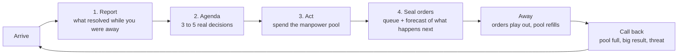

# Every Visit Is a Turn — Design Proposal

> **Status:** Design proposal, not yet committed. It gives Border Empires the
> hook its core loop is missing. It builds on the Activity dashboard plan
> (`docs/activity-dashboard-plan.md`) and on systems that already ship.
> Player-facing summary: `docs/core-loop.md` §0.
>
> **Update 2026-09-23:** decisions since this was written are recorded in
> `docs/replenishment-update-plan.md`. There are no "turns" in the UI: the
> player sees "Manpower replenishes in xxh xxmin". Manpower arrives in 6h
> chunks that stack for 24h, the gold cap is removed, and nothing resolves at
> a shared tick. Muster flags become investments that shields can counter
> (`docs/muster-fronts-proposal.md`).

## 1. The problem

Turn-based 4X games are sticky because every turn follows the same rhythm:

1. **Resolve:** the orders you gave last turn play out and you see what
   happened.
2. **Decide:** the new situation hands you a small number of meaningful
   choices.
3. **Commit:** you give orders and press *End turn*.
4. **Anticipate:** something you set up is still pending, and you want to see
   how it turns out. That is "one more turn".

Border Empires runs in real time. What the player experiences is a stream of
clicks with no step where they resolve: you click, wait and click again. A
beta tester put it this way: "you have clicks, not turns, and they don't make
you hooked". The expansion-plateau feedback in
`docs/expansion-motivation-exploration-brief.md` ("I stop expanding once my
economy runs") is the same symptom seen from the economy side.

The game is already built around visiting a couple of times a day, not
playing continuously (`docs/core-loop.md` §1, pillar 3). So the natural unit
of play isn't a click or a turn. **It's a visit.** This proposal makes every
visit feel like a turn: it opens with results, offers a few real decisions,
ends with orders given, and leaves you with something to come back for.

## 2. The turn structure

Each step maps onto something that exists or is already planned. Most of the
work is framing the pieces as one sequence, not building new systems.

### 2.1 Report: "what happened on your turn"

**Goal:** the first 10 seconds of a visit are a payoff, not a to-do list.

- **Builds on:** the Activity dashboard's "since you were away" briefing and
  summary line (`docs/activity-dashboard-plan.md` §2.1–2.2, Phases 1–2).
  It already shows tiles claimed and lost, raids, waystations, towns and
  completed buildings, with a Center button on each.
- **Add: an ordered turn report.** Show the pending orders that completed
  first (settles and builds from the queue, waypoint pushes, town tiers
  reached, monument stages), then what others did to you. The player should
  see their own plan working before they see the damage.
- **Add: a "Map since your last visit" playback.** A short animation of
  borders changing since the last visit. It gives the feeling of watching
  your turn resolve and makes rival movement readable at a glance. Like any
  map visual, it must be built for both the 2D and true-3D renderers.
- **Add: progress deltas.** Victory-race progress and rank change since the
  last visit ("Maritime Supremacy 31% → 36%"). The World at a glance row has
  room for this.

### 2.2 Agenda: "your decisions this turn"

**Goal:** turn the click stream into a small number of decisions that
matter.

A curated panel of **3–5 agenda items**, computed when the player arrives
and ranked by impact. Each item is one tap to jump to the right tile or
panel. Candidates, all derived from existing state:

| Agenda item | Source it can use |
|---|---|
| Town ready to upgrade a tier (population passed the threshold) | `town-growth.ts`, `TOWN_TIER_UPGRADE_GOLD_COST` |
| Manpower at or near cap (regen is being wasted) | player manpower and cap |
| Idle development slots | `DEVELOPMENT_PROCESS_LIMIT`, active processes |
| Unfed town (growth and gold paused) | fed-town set in `runtime-population-growth.ts` |
| Dormant structures (missing a slot) | slot dormancy engine |
| Waystation or town just past your reach edge (candidate beacon target) | reach border + world sites |
| Exposed FRONTIER bordering an enemy | reach / frontier state |
| Tech or domain affordable | tech and domain costs |
| Shard rain in the next hour (08:00 and 21:00 UTC) | `runtime-shard-rain-rules.ts` |
| Victory hold running, yours or a rival's | `SEASON_VICTORY_*` state |

The onboarding checklist (`client-onboarding-checklist.ts`) already does
this for the first session: it computes the next goal and highlights the
tile on the map. The agenda is the same pattern kept running for the rest of
the season.

### 2.3 Act: spend the turn budget

**Goal:** each visit has a natural size.

- The **manpower pool is the turn budget**. A visit should roughly use up
  what has built up since the last one. This is already how the economy is
  paced (`docs/core-loop.md` §4.2).
- Show the budget explicitly: "Manpower 640 / 750 · spend it or lose regen".
- Keep decisions weighty. The per-target attack costs, settle-by-hand choices
  (defense, roads, beacon sites) and slot allocation already make spending a
  real choice. The agenda points at them.

### 2.4 Seal orders: "End turn"

**Goal:** give the visit a clear ending, and give the player a reason to
return.

- **Builds on:** the dev queue (20 server-side + 40 planned entries,
  `dev-queue.ts`), waypoints that replay while offline (`waypoint-planner.ts`),
  muster flags.
- **Add: an "End visit" summary** (optional, never required). It shows a
  forecast of what will happen while you're away:
  - "6 settles and 1 beacon will finish in the next 2h"
  - "Manpower full in about 9h"
  - "Rivergate reaches City in about 14h"
  - "Next shard rain 21:00 UTC"
  - "Your Maritime hold completes in 18h if you hold 55% of docks"

  This is the pending outcome in the Anticipate step, made visible. The
  earliest meaningful item in the forecast becomes the suggested time to come
  back.
- The forecast must be computed from the same rules the simulation uses, so
  it never promises something that won't happen.

### 2.5 Away and call back

**Goal:** the time between visits has a pulse, and the game calls you back at
the right moment.

- **Builds on:** email notifications (alliance, truce, attack, Aether Purge,
  season start) and offline waypoint replay.
- **Add: return pings for a good turn, not only for bad news:**
  - **Manpower full.** The most important ping: it is the moment the next
    turn is ready, and missing it wastes regen.
  - A queued plan has finished.
  - A town reached a new tier.
  - A victory hold started or is in danger.
  - Shard rain is starting soon.

  Each of these should be something the player can opt out of. Today only
  alarms (attacks, breaks, offers) have email categories.
- **Keep the design rule of no punishment for being offline.** Being away is
  simply the other half of the turn. This rules out decay mechanics for time
  offline (`docs/core-loop.md` §1).

## 3. Why this fixes the hook

| Turn rhythm | Border Empires today | With this proposal |
|---|---|---|
| Resolve | A chronological 24h log, when you open it | A turn report: your plan's results first, map playback, progress deltas |
| Decide | Find your own things to do | 3–5 ranked agenda items, one tap each |
| Commit | Queue exists but has no ending moment | "End visit" with a forecast |
| Anticipate | Nothing names what's pending | The forecast plus return pings for good news |

The hook becomes: **"see what my turn produced, and set up the next one"**.

## 4. Delivery phases (cheapest first)

1. **Turn report on the Activity dashboard.** Order the existing briefing
   with your own completions first, and add progress deltas. Needs the
   Activity dashboard Phases 1–2.
2. **Manpower-full ping and forecast math.** Add a shared, pure forecast
   module (manpower-full time, queue completion times, town-tier ETAs) used
   by both the client and the notifier. Add the "manpower full" email
   category.
3. **Agenda panel.** Compute agenda items on the client from state it already
   has, extending the onboarding checklist pattern. Rank by impact. Measure
   which items get acted on.
4. **"End visit" summary.** Shows the forecast and the suggested return time.
5. **Map playback since last visit.** The most expensive step (it needs a
   bounded border-change history). Must be built for both renderers.

## 5. How to tell it's working

- The share of visits that end with a non-empty queue.
- How long after a manpower-full ping the player comes back (and the share
  that come back before regen is wasted).
- Visits per day per active player, and retention after day 3 and day 7.
- The share of agenda items acted on, per item type, to prune weak ones.
- Fewer "nothing to do" and "I stopped expanding" reports in feedback.

## 6. Open questions

1. Should "End visit" be an explicit button, or just a summary that appears
   when the player backgrounds the app or goes idle?
2. Push notifications (mobile/PWA) as well as email? Manpower-full is
   time-sensitive in a way email isn't.
3. How long should border-change history be kept for map playback, given the
   limits in `docs/agents/state-and-persistence-discipline.md`?
4. Should the agenda include suggestions from the AI planner's strategic
   snapshot (for example, the best victory path), or only facts?
